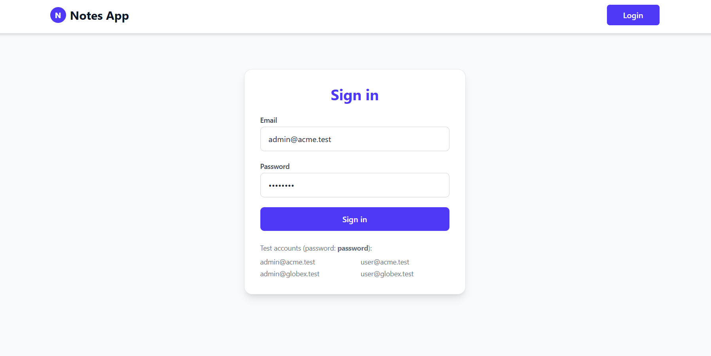
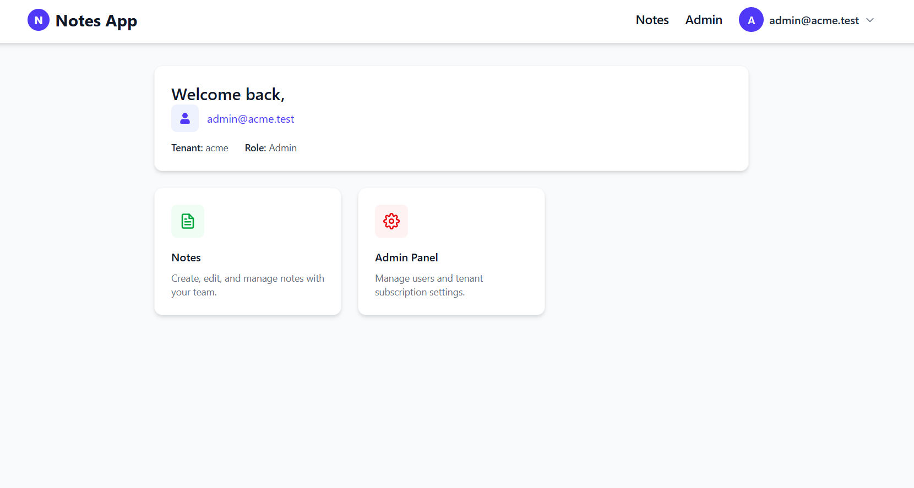
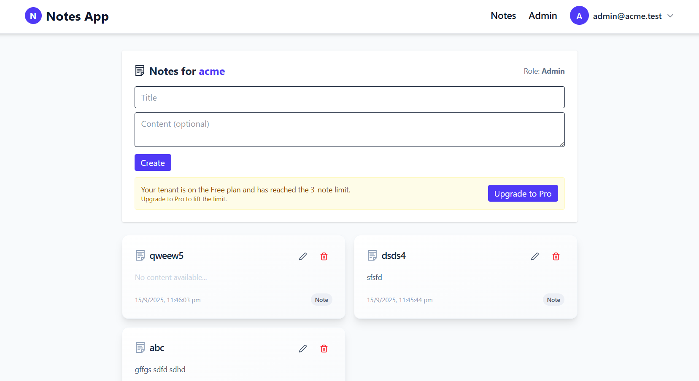
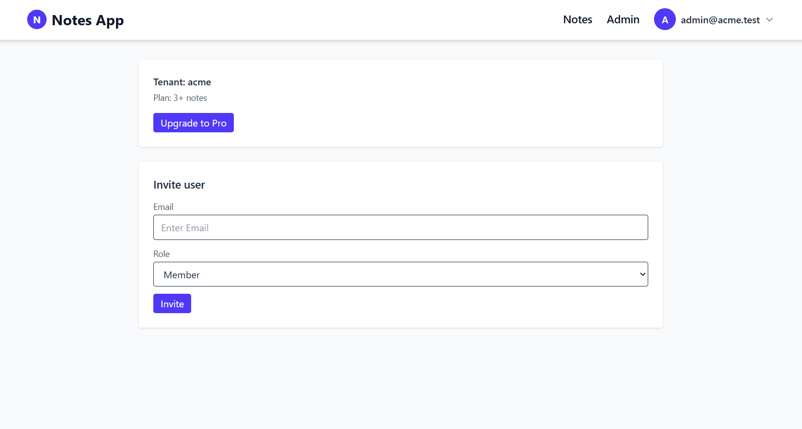

# 📝 Multi-Tenant Notes Application

A **multi-tenant Notes Application** built with the **MERN stack (MongoDB, Express.js, React, Node.js)** and deployed on **Vercel**.  
The app supports multiple tenants (companies), role-based access control, subscription-based feature, and strict tenant isolation.

---

## 🚀 Features

- **Multi-Tenancy**
  - Supports multiple tenants (`Acme` and `Globex`).
  - Strict tenant data isolation.
  - Implemented using **shared schema with tenant ID column**.

- **Authentication & Authorization**
  - JWT-based login.
  - Role-based access:
    - **Admin**: invite users, upgrade subscriptions.
    - **Member**: manage their notes (CRUD).

- **Subscription Plans**
  - **Free Plan**: Maximum of 3 notes.
  - **Pro Plan**: Unlimited notes.
  - Upgrade endpoint: `POST /tenants/:slug/upgrade` (Admin only).

- **Notes API (CRUD)**
  - `POST /notes` – Create a note.
  - `GET /notes` – List all notes (for current tenant).
  - `GET /notes/:id` – Retrieve a note.
  - `PUT /notes/:id` – Update a note.
  - `DELETE /notes/:id` – Delete a note.

- **Deployment**
  - Backend and frontend hosted on **Vercel**.
  - CORS enabled for cross-origin access.
  - Health check endpoint:  
    ```
    GET /health
    - { "status": "ok" }
    ```

- **Frontend**
  - Minimal React-based frontend.
  - Login with predefined accounts.
  - Create, list, and delete notes.
  - “Upgrade to Pro” option when Free plan limit is reached.

---

## 🛠️Tech Stack

- **Frontend**: React, Tailwind CSS, Vercel Deployment  
- **Backend**: Node.js, Express.js, MongoDB (Mongoose ODM), JWT Authentication, Vercel Deployment  
- **Database**: MongoDB Atlas (cloud-hosted)  
- **Hosting**: Vercel 

---

## 🔑 Test Accounts

Use the following accounts (all passwords: `password`):

| Email              | Role   | Tenant |
|--------------------|--------|--------|
| admin@acme.test    | Admin  | Acme   |
| user@acme.test     | Member | Acme   |
| admin@globex.test  | Admin  | Globex |
| user@globex.test   | Member | Globex |

---

## ⚙️ Setup & Installation

### 1️. Clone Repository
```bash
git clone https://github.com/yourusername/saas-notes-app.git
cd saas-notes-app
```
### 2. Backend Setup
``` bash
cd backend
npm install
```

Create a `.env` file in `backend/` with:
```env
PORT=
MONGO_URI=
JWT_SECRET=
```

Run backend locally:
```bash
npm run server
```

### 3. Frontend Setup
```bash
cd frontend
npm install
```

Create a `.env` file in `frontend/` with: 
``` env
REACT_APP_API_URL=
```

Run frontend locally:
```bash
npm run dev
```
---

## 🌐 Deployment
 - Both frontend and backend are deployed on Vercel.
 - Ensure proper CORS configuration for API accessibility.
 - MongoDB Atlas used as database.

---

## API Endpoints

### Authentication
 - `POST /auth/login` - Login and receive JWT.

### Tenants
 - `POST /tenants/:slug/upgrade` - Upgrade tenant plan (Admin only).

### Notes
 - `POST /notes` - Create a note.
 - `GET /notes` - List all notes.
 - `GET /notes/:id` - Get a note.
 - `PUT /notes/:id` - Update a note.
 - `DELETE /notes/:id` - Delete a note.

### Health Check
 - `GET /health` - `{ "status": "ok" }`

---

## 📸 Screenshots

**Login page:** 



**Dashboard:**



**Notes page:**



**Admin page:**



---

## Live Link  
https://notes-application-frontend-three.vercel.app/
